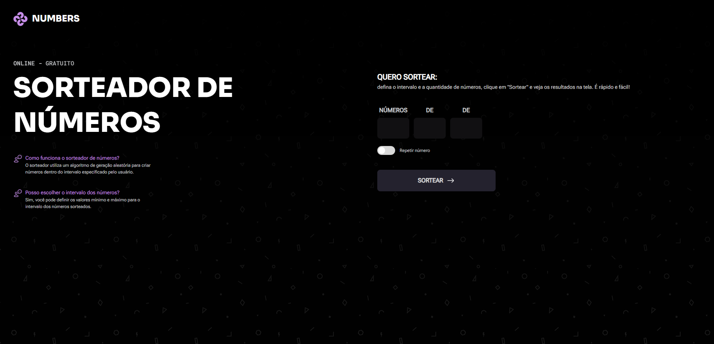

<h1 align="center"> 🔢 NUMBERS 🔢</h1>

Projeto pessoal utilizando conceitos HTML, CSS e Javascript.

  <a href="#-tecnologias">Tecnologias</a>&nbsp;&nbsp;&nbsp;|&nbsp;&nbsp;&nbsp;
  <a href="#-projeto">Projeto</a>&nbsp;&nbsp;&nbsp;|&nbsp;&nbsp;&nbsp;
  <a href="#-layout">Layout</a>&nbsp;&nbsp;&nbsp;

 

  

## 🚀 Tecnologias

Esse projeto foi desenvolvido com as seguintes tecnologias:

-   HTML e CSS
-   Javascript
-   Git e GitHub
-   Figma

## 💻 Projeto

NUMBERS é um sorteador de números, em que o usuário determina quantidade de números e o intervalo entre dois números a serem sorteados. <a href="https://numbers-mocha.vercel.app/" target="_blank" rel="noopener noreferrer">aqui</a> para testar a página.

## 🎨 Layout

Clique <a href="https://www.figma.com/design/Jk8B7dGYrVp1LnfepL0r7A/Sorteador-de-n%C3%BAmeros--Community-?node-id=3-376&p=f&t=zZuQqrfCfky3PN6K-0">aqui</a> para conhecer a prototipagem do projeto.
 
 
 
 

Desenvolvido com ♥ by Mateus de Castro Macedo 👨‍💻

